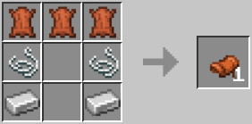

# CraftableSaddle

A Minecraft datapack to add a saddle recipe to the game.

## Recipe
The recipe to craft the saddle make use of leather, iron ingot and strings as follow : 

## Installation
Visit the [minecraft wiki](https://minecraft.fandom.com/wiki/Tutorials/Installing_a_data_pack) to know how to install a data pack.
